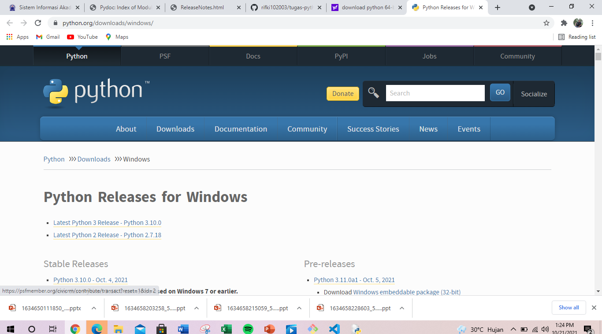
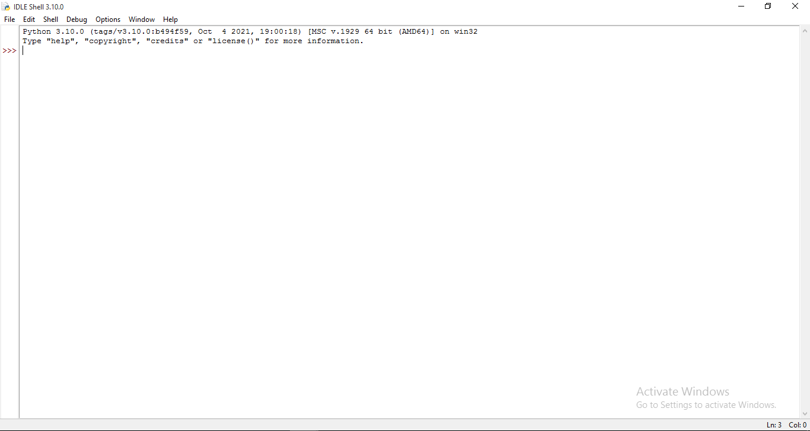
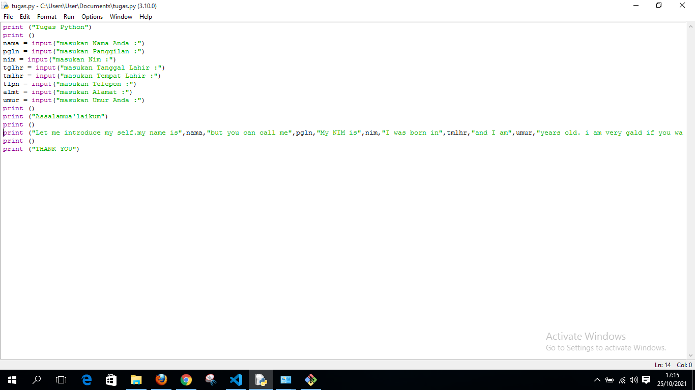
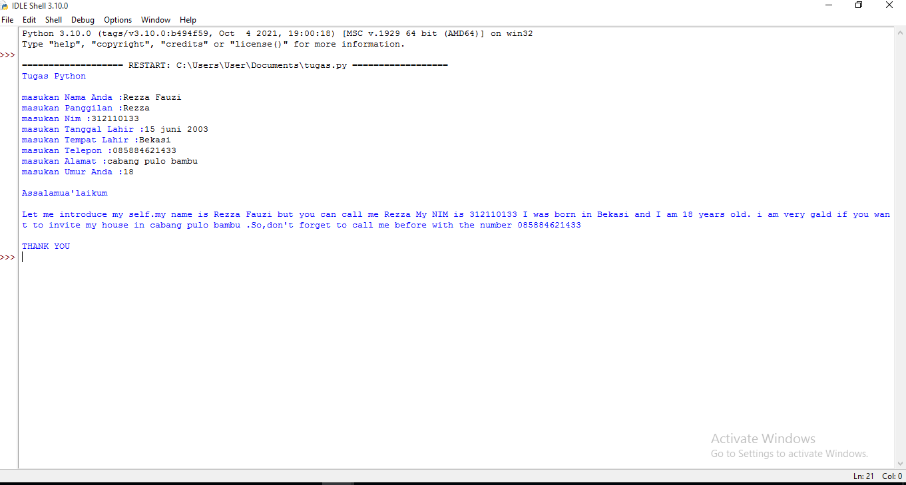

# python-tugas
## Penggunaan python

### Membuat Tutorial Python
Berikut langkah - langkah penggunaan Git.

1.download terlebih dahulu python nya berikut link nya https://www.python.org/

2.jika sudah cari file python yang sudah terdownload lalu klik dan install jika sudah terinstall lalu masuk ke jendela windows di pojok kiri bawah lalu cari file bernama IDLE.Python dan klik akan muncul seperti ini.

3.Jika sudah pilih file lalu klik new file akan muncul folder kosong yang bisa kalian masukan script program yang ingin kalian buat seperti ini

 
berikut script nya 

    print ("Tugas Python")
    print ()
    nama = input("masukan Nama Anda :")
    pgln = input("masukan Panggilan :")
    nim = input("masukan Nim :")
    tglhr = input("masukan Tanggal Lahir :")
    tmlhr = input("masukan Tempat Lahir :")
    tlpn = input("masukan Telepon :")
    almt = input("masukan Alamat :")
    umur = input("masukan Umur Anda :")
    print ()
    print ("Assalamua'laikum")
    print ()
    print ("Let me introduce my self.my name is",nama,"but you can call me",pgln,"My NIM is",nim,"I was born in",tmlhr,"and I am",umur,"years old. i am very gald if you want to invite my house in",almt,".So,don't forget to call me before with the number",tlpn,)
    print ()
    print ("THANK YOU")

jika sudah lalu pilih run untuk menjalankan program seperti ini,

    Tugas Python

    masukan Nama Anda :Rezza Fauzi
    masukan Panggilan :Rezza
    masukan Nim :312110133
    masukan Tanggal Lahir :15 juni 2003
    masukan Tempat Lahir :Bekasi
    masukan Telepon :085884621433
    masukan Alamat :cabang pulo bambu
    masukan Umur Anda :18

    Assalamua'laikum

    Let me introduce my self.my name is Rezza Fauzi but you can call me Rezza My NIM is 312110133 I was born in Bekasi and I am 18 years old. i am very gald if you want to invite my house in cabang pulo bambu .So,don't forget to call me before with the number 085884621433

    THANK YOU

Dan selesai sudah tutorial penggunaan Python

